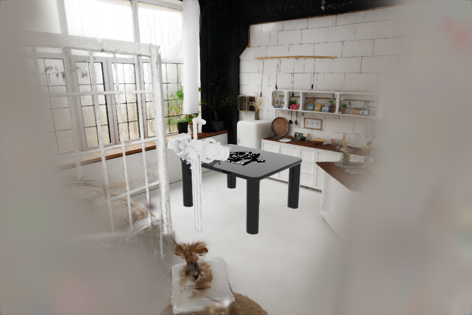

# humanoid-garment-fold

Bimanual **garment-folding** Isaac Lab task for the WATonomous `pioneer_bimanual_arm`,
ported from the [LeHome Challenge](https://github.com/lehome-official/lehome-challenge)
(ICRA 2026). Fold long/short tops and long/short pants on a table; success is
judged on the cloth's particle geometry, not the robot.



## Status

| Piece | State |
|---|---|
| LeHome's `GarmentEnv` + particle cloth + success checker + reward | ✅ vendored (`lehome@a805ad2`, Apache-2.0, see `NOTICE`) |
| Retargeted to one `pioneer_bimanual_arm` articulation | ✅ `GarmentPioneerEnv` (subclass; overrides `_setup_scene` / `_apply_action` / `_get_observations` / `_reset_idx`) |
| Gym id `Humanoid-GarmentFold-Bimanual-Pioneer-v0` | ✅ |
| Scene (`Scene_00_Apartment.usd`) + garment on the table | ✅ loads; runs in LeHome's venv (verified) |
| Arm base pose vs the garment | ✅ measured — `(0, -0.63, 0.68)` + `+90° about Z` (front axis is `+X`) |
| **Arm default joint pose** | ⚠️ droops — `pioneer_humanoid.bimanual_arm._DEFAULT_JOINT_POS` is an asymmetric capture, not a fold-ready spread |
| **Wrist camera offsets** | ⚠️ SO101-sized, currently buried in the pioneer wrist link |
| Full 600-step episode / success-checker firing | ❌ not verified |
| Teleop → demos → LeRobot training | ❌ not wired |

## Layout

```
garment_fold_task/
├── LICENSE / NOTICE            Apache-2.0 + what was vendored/modified (§4)
├── pyproject.toml
├── vendor_assets/
│   ├── garments/Release/       1 sample garment per category (committed, ~6 MB)
│   ├── scenes/Table038/        fallback table (committed, ~1.2 MB)
│   └── scenes/marble/          Scene_00_Apartment.usd — .gitignore'd, you copy it
└── humanoid_garment_fold/
    ├── tasks/
    │   ├── garment_env.py            VENDORED — the GarmentEnv base
    │   ├── garment_env_cfg.py        VENDORED — base cfg (robot fields removed)
    │   ├── challenge_garment_loader.py  VENDORED
    │   ├── garment_pioneer_cfg.py    NEW — pioneer config
    │   ├── garment_pioneer_env.py    NEW — pioneer env (subclass)
    │   └── __init__.py               gym.register(...)
    ├── assets/
    │   ├── garment_object.py         VENDORED — PhysX particle-cloth garment
    │   ├── scene.py                  adapted — scene USD paths
    │   └── robots/bimanual_arm.py    NEW — re-export of the repo's BIMANUAL_ARM_CFG
    ├── utils/
    │   ├── success_checker_garment.py  VENDORED — fold-quality check
    │   └── logger.py                 NEW — console shim
    └── config/particle_garment_cfg.yaml  VENDORED — particle solver params
```

## The retarget

Upstream drives **two SO101 follower arms** (`left_arm` + `right_arm`, 12-dim
action). This drives **one `pioneer_bimanual_arm`**:

* left chain `joint1L`, `joint2l..joint6l` (+ gripper `joint7l`/`joint8l`), EE `link6l`
* right chain `joint1..joint6` (+ gripper `joint7`/`joint8`), EE `link6`

(L-suffix = LEFT, matching the repo's corrected convention. The joint/body name
lists and `BIMANUAL_ARM_CFG` are imported from the `pioneer_humanoid` package —
see `assets/robots/bimanual_arm.py`.)

Action stays **12-dim**: `[left arm ×6, right arm ×6]` joint-position targets;
grippers are held open. Joint names → articulation indices are resolved once in
`__init__`.

**Front axis.** The pioneer arm reaches into `+X` at identity rotation — from
this repo's `tools/isaac_harness/scenes/bimanual_vial_rack.sh` and
`pick_place_bimanual` (`TABLE_X_MIN=0.18`, `TABLE_TOP_Z=0.05`, table centre
`x=0.63`). LeHome's garment sits at world `~(0, 0, 0.63)`, so the base is rotated
`+90°` about Z and placed `0.63 m` behind in `-Y`.

**Scene.** `_build_worksurface()` tries, in order: (1) optional NuRec backdrop,
(2) `Scene_00_Apartment.usd` at `/World/Scene` (default — the photoreal apartment
+ table), (3) ground + vendored `Table038.usd`, (4) ground only. The apartment
USD is `.gitignore`d (~19 MB) — copy it in.

## Run it

Today it runs in **LeHome's own venv** (has Isaac Sim 5.1 + all deps). To run in
this repo's `isaac_lab` image:

1. `pip install omegaconf` in the image (the Dockerfile already does this) and
   `pip install -e src/simulation/garment_fold_task`.
2. Copy the **whole** `Assets/scenes/marble/` folder from the LeHome challenge
   into `vendor_assets/scenes/marble/` — the `.usd` references the `.usdz` next
   to it and won't load without both.
3. `isaaclab.sh -p scripts/smoke_test.py --garment Top_Long_Seen_1` — builds the
   env, resets, writes 4 camera PNGs.

## To finish

1. **Symmetric fold-ready joint pose** + tune the 4 gripper prismatic joints for
   pinching fabric.
2. **Fix the wrist-cam offsets** for the pioneer wrist link.
3. **Full-episode smoke test** — 600 steps, confirm `success_checker_garment_fold`
   fires and the per-garment `check_point` particle indices still line up.
4. **Full garment set**: `hf download lehome/asset_challenge` →
   `garment_cfg_base_path`.
5. **Data + training**: pioneer teleop (this repo's `src/teleop/` or
   `quest_isaac_teleop`, both IK) → record demos → `lerobot-train` with LeHome's
   ACT / DP / SmolVLA configs.

## Notes from the port

* `Scene_00_Apartment.usd` composes only a table when opened minimally; the
  photoreal apartment (NuRec `.usdz`) renders through the full Isaac Sim
  pipeline. Both are in the LeHome `Assets/scenes/marble/`; `scene_v1.usd` (the
  room mesh) ships in neither the repo nor the HF dataset.
* Only the **fold** task is real. LeHome registers a `...-fling-v0` env but the
  entry-point files aren't in the repo.
